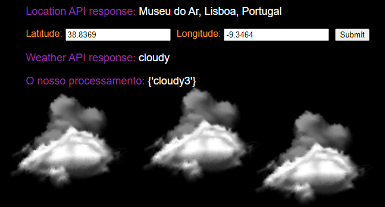

## Django Examples

Este projeto tem como objetivo agregar várias apps para exemplificar / demonstrar 
capacidades do django.

Muitas delas (ok só tem uma neste momento mas calma) incluem desafios para melhorar a sua funcionalidade / performance que podem usar para desenvolver e praticar as vossas capacidades de **Python** e **Django**.

### Instalação / Setup
1. `git clone https://github.com/rosaqq/django-examples.git`
2. Dentro da pasta do repositório:
   1. `pip install -r requirements.txt`
   2. `python manage.py runserver`

### Organização

Existe uma `main_app` que gera a página de entrada no _website_ com ligações para as apps existentes.  
Isto é automático, desde que adicionem as vossas apps da maneira correta no `urls.py` do projeto.

À partida não devem modificar esta aplicação.

### Demo Apps:

- **Simple Weather**  
    
  Esta app mostra uma visualização simples do estado de tempo nas coordenadas GPS especificadas.  
  Desafios:
    - Garantir o input de coordenadas certas (input validation).
    - A página demora 4-5s segundos a carregar! Fix it!
    - Completar a app com mais casos de tempo (imagens já estão incluídas).
